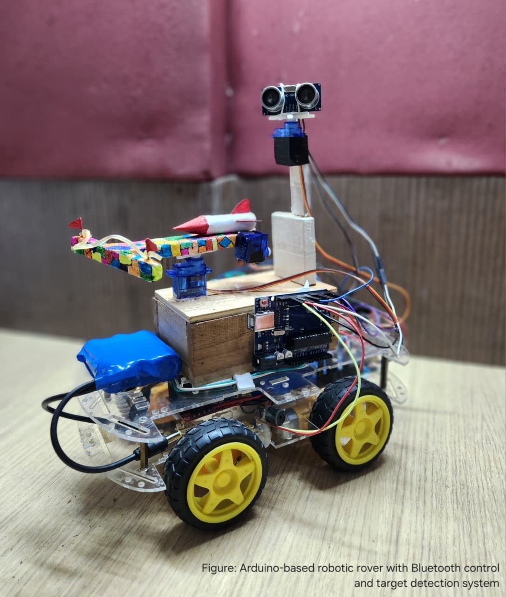
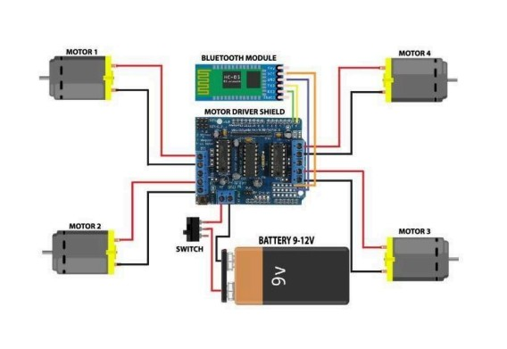
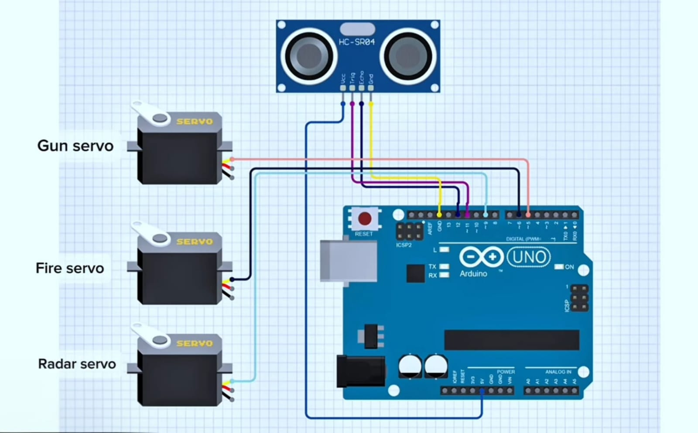

<div align="center">

# SENTINEL-X

### *Autonomous Radar Target Tracking & Mobile Robotics Platform*

[](https://www.arduino.cc/)
[](https://isocpp.org/)
[](LICENSE)
[]()

</div>

---

## 📌 Project Overview

**SENTINEL-X** is a hybrid autonomous robotic system integrating Bluetooth-based manual navigation with an ultrasonic radar target tracking and precision micro-actuation assembly. Controlled by an Arduino Uno (ATmega328P) microcontroller, SENTINEL-X demonstrates real-time sensor processing, coordinate transformation geometry, and synchronized multi-servo actuation.

<p align="center">
  
</p>

<p align="center">
  <i>Figure 1: SENTINEL-X Autonomous Target Tracking & Mobile Platform Prototype</i>
</p>

---

## 🎥 Demo Video

<p align="center">
  <a href="https://drive.google.com/file/d/1D94xuz0M3TwoiSXlzDACoq84ioxJkqHk/view?usp=drivesdk" target="_blank">
    
  </a>
</p>

---

## ✨ Key Features

- **📶 Dual Control Architecture**: Seamless switching between Bluetooth wireless manual driving and semi-autonomous radar sweeping.
- **📡 180° Radar Sweeping System**: Pan-servo mounted ultrasonic sensor continuously scans for obstacles/targets within a defined sector.
- **📐 Trigonometric Coordinate Alignment**: Computes compensation angle using inverse trigonometric functions (`atan2`, `sin`, `cos`) to adjust actuator pitch.
- **⚡ Precision Actuation System**: Servo-controlled dual-axis alignment and rapid trigger release mechanism.
- **🔔 Audio-Visual Safety Warning**: Pulsed piezo buzzer and LED indicator sequence before executing actuation.
- **🛡️ Emergency Abort & Manual Override**: Instantly pause scanning or manually trigger actuation via Bluetooth commands.

---

## 🏗️ System Architecture

```
                                +---------------------------+
                                |  HC-05 Bluetooth Module   |
                                +-------------+-------------+
                                              |
                                              v
+-----------------------+       +-------------+-------------+       +-----------------------+
|  4WD DC Motors Chassis | <----+     Arduino Uno (MCU)     +-----> | Ultrasonic Radar Pan  |
|  via L298N Driver     |       |   (ATmega328P Logic)      |       | HC-SR04 + Servo (D9)  |
+-----------------------+       +-------------+-------------+       +-----------------------+
                                              |
                                              v
                                +-------------+-------------+
                                | Dual Servo Actuator Unit  |
                                | Pitch Aim (D5) / Fire (D6)|
                                +---------------------------+
```

---

## 🔬 Mathematical Targeting Model

When an obstacle is detected at distance $r$ and radar scanning angle $\theta_0$, polar coordinates are transformed into Cartesian coordinates relative to the actuator pivot point ($\Delta Y = 8\text{ cm}$ vertical displacement offset):

$$\text{Target}_X = r \cdot \cos(\theta_0) - \Delta X$$

$$\text{Target}_Y = r \cdot \sin(\theta_0) - \Delta Y$$

$$\theta_{\text{actuator}} = \arctan\left(\frac{\text{Target}_Y}{\text{Target}_X}\right)$$

The pitch servo (`aimServo`) smoothly rotates to $\theta_{\text{actuator}}$ to ensure accurate target alignment.

---

## 🔌 Hardware Wiring & Schematic Diagrams

### 1. Mobility Drive System Wiring
<p align="center">
  
</p>

### 2. Targeting & Actuator Subsystem Wiring
<p align="center">
  
</p>

---

## 🛒 Bill of Materials (BOM)

| Component | Quantity | Purpose |
| :--- | :---: | :--- |
| **Arduino Uno R3** | 1 | Main System Controller |
| **L298N Motor Driver Shield** | 1 | High-current DC Motor Driver |
| **HC-05 Bluetooth Transceiver** | 1 | Wireless UART Communications |
| **HC-SR04 Ultrasonic Sensor** | 1 | Distance Measurement & Radar Scanning |
| **SG90 / MG996R Servos** | 3 | Radar Sweep (D9), Pitch Aim (D5), Trigger Release (D6) |
| **BO Geared DC Motors** | 4 | Chassis Mobility |
| **Piezo Buzzer / Status LED** | 1 | Audio-Visual Warning System |
| **12V Li-ion Battery Pack** | 1 | Power Supply |

---

## 📂 Project Directory Structure

```plaintext
SENTINEL-X/
├── code/
│   ├── rover_control/
│   │   └── rover.ino          # Firmware for Bluetooth 4WD chassis mobility
│   └── targeting_system/
│       └── targeting.ino      # Firmware for ultrasonic radar scanning & actuation
├── docs/
│   └── project_details.md     # Detailed academic & engineering documentation
├── images/
│   ├── rover.jpeg             # Prototype chassis photograph
│   ├── circuit_rover.jpeg     # Schematic for mobility subsystem
│   └── circuit_launcher.jpeg  # Schematic for actuator subsystem
├── .gitignore                 # Git ignore file for Arduino/IDE binaries
├── LICENSE                    # MIT Open Source License
└── README.md                  # Project documentation homepage
```

---

## 🚀 Getting Started

### Prerequisites
- [Arduino IDE](https://www.arduino.cc/en/software) (v1.8.x or v2.x)
- Required Arduino Libraries:
  - `Servo.h` (Built-in)
  - `SoftwareSerial.h` (Built-in)

### Installation & Flashing
1. Clone this repository:
   ```bash
   git clone https://github.com/YOUR_USERNAME/SENTINEL-X.git
   ```
2. Open `code/rover_control/rover.ino` in Arduino IDE, select **Arduino Uno**, choose the correct COM port, and upload.
3. Open `code/targeting_system/targeting.ino` in Arduino IDE and upload to the targeting controller board.
4. Pair your mobile device with the HC-05 Bluetooth module (Default Passcode: `1234` or `0000`).

### Bluetooth Command Reference
| Key Byte | Function |
| :---: | :--- |
| **`F`** | Drive Forward |
| **`B`** | Drive Backward |
| **`L`** | Turn Left |
| **`R`** | Turn Right |
| **`S`** | Halt All Motors |
| **`O`** | Enable Radar Scanning Mode |
| **`F`** | Abort Radar Scanning Mode |
| **`X`** | Manual Actuation Override Trigger |

---

## 📄 License

Distributed under the MIT License. See [`LICENSE`](LICENSE) for more details.

---

## 👨‍💻 Authors & Acknowledgments

- **Deepak Gupta** - Co-Developer & Project Lead
- **Devashees Rana** - Co-Developer & Hardware Engineering

*Developed as an educational research demonstration in autonomous embedded systems and robotics.*
